# Swiss-FEGA user documentation

This manual explains how to submit and request one or multiple datasets from the Swiss node of the Federated European Genome-Phenome Archive (Swiss-FEGA).

Some sections of the web portal are publicly visible, while others require authentication via Switch edu-ID (indicated by a lock icon).

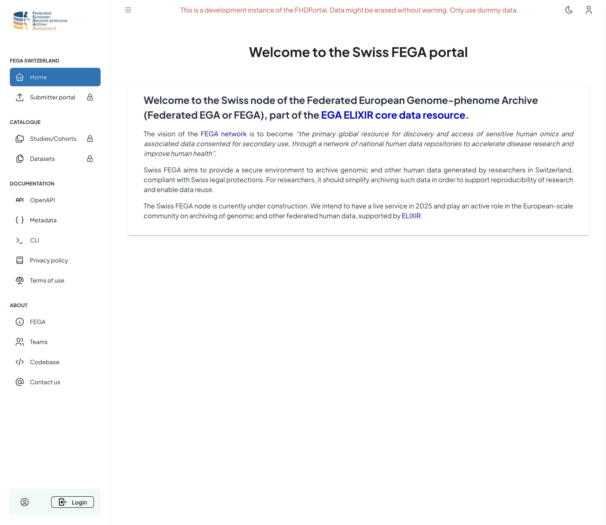


## Submitter portal

### Request a submitter role (only necessary for your first submission)

Only FEGA users with a **submitter** role are authorized to register a data submission. 

1. Click on Submitter portal

2. Login on the Switch-Edu-ID login portal

3. Request a **submitter** role: 

   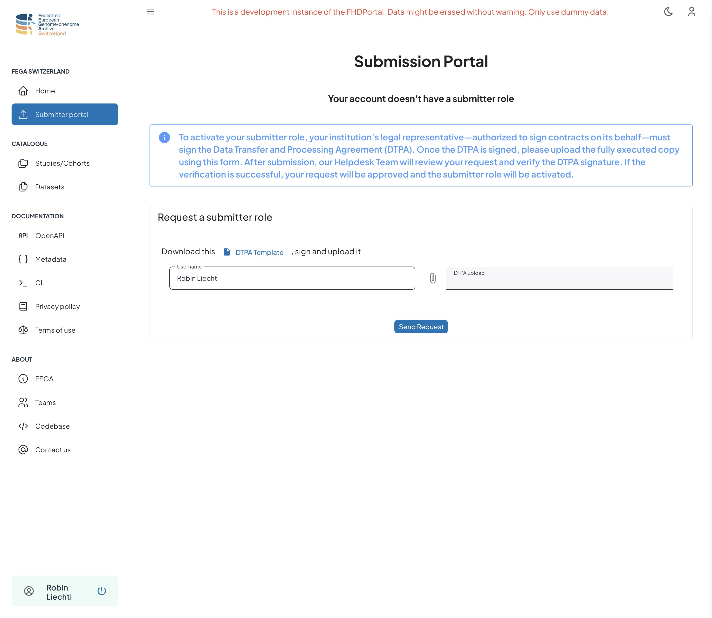

   - Download the DTPA template from the **Request a submitter role** form
   - The legal representative of your institution will sign this form
   - Upload the signed document using the **DTPA upload** field.
   - Click **Send Request**.
   - A ticket is then opened on the Swiss-FEGA help desk. Once your **submitter** role is reviewed, a notification email will be sent to your address.

   ### Create and register an SSH key pair (only necessary for the first upload)

   The SSH key pair is required to authenticate to the SFTP inbox where you will upload your encrypted files.

   A full documentation is available: https://www.ssh.com/academy/ssh/keygen

   ```bash
   ssh-keygen -t ed25519 -C "your_email@example.com"
   > Generating public/private ALGORITHM key pair.
   > Enter a file in which to save the key (/Users/YOU/.ssh/id_ed25519): [Press enter]
   ```

   Copy the content of the **public** key (`/users/YOU/.ssh/id_ed25519.pub`) in the FHD portal form **List of registered SSH public keys :**

   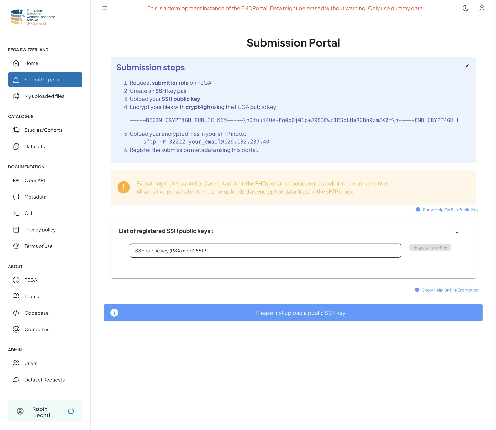

### Encrypt and upload files on the secure data archive (SDA)

Sensitive data files must be encrypted with **crypt4gh** prior to upload into the SFTP server

#### Encrypting your files

The FEGA encryption of this inbox is based on [Crypt4GH](https://crypt4gh.readthedocs.io/en/latest/). You can install a python implementation of it, with

```bash
pip install crypt4gh
```

or directly from the [Github repository](https://github.com/EGA-archive/crypt4gh)

```bash
pip install git+https://github.com/EGA-archive/crypt4gh.git
```

Save now the following Crypt4GH public key, into a file, say `ingestion.pubkey.`

```bash
-----BEGIN CRYPT4GH PUBLIC KEY-----
iT9V6iGJCcS2kCOQtSlVGv3LUGQsDU4lYLi4CL7dJAo=
-----END CRYPT4GH PUBLIC KEY-----
```

Encrypt a given file with the following command:

```bash
crypt4gh encrypt --recipient_pk ingestion.pubkey < file_to_encrypt > encrypted_file.c4gh
```

The command reads the file from `stdin` (with `<` ) and output the encrypted version to `stdout` (with `>` ).  
Replace `file_to_encrypt` and `encrypted_file.c4gh` with the appropriate filenames. Do not use the same filename for input and output, otherwise the shell may truncate your files before they are read or written.

#### Uploading your files

Upload is done via the SFTP protocol using the ssh key created above.

```bash
SFTP -P 32222 your_email@129.132.237.40
```

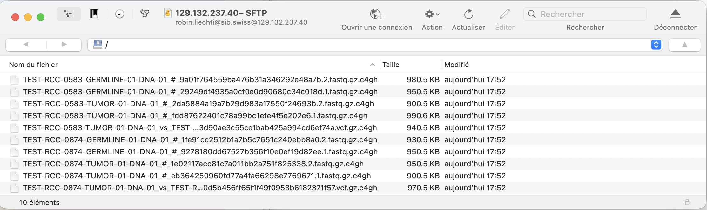

#### Checking that your uploaded files have been registered 

Navigate to **My uploaded files** and check that your files are listed.

## Register submission metadata

1. In the **Submitter portal**, click on **Submit a new study**.

2. File in the form (required fields are highlighted in red) and click on **Save and Create Samples**.

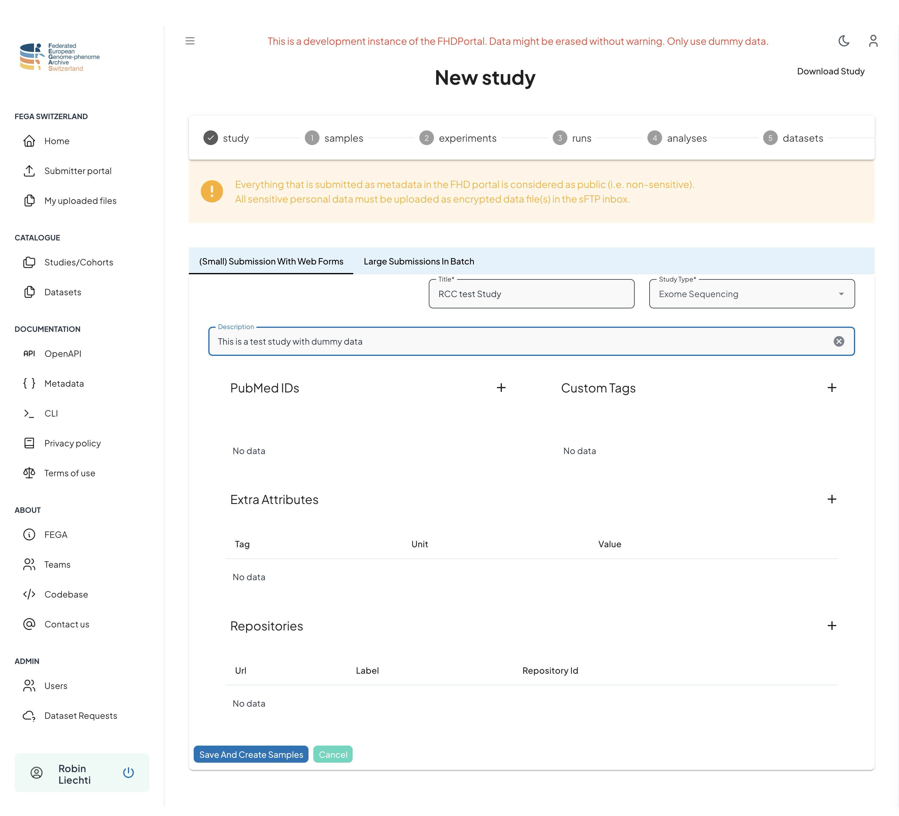

3. Click on **Create new Sample**...
4. File-in the form (required fields are highlighted in red) and click on **Save sample**.

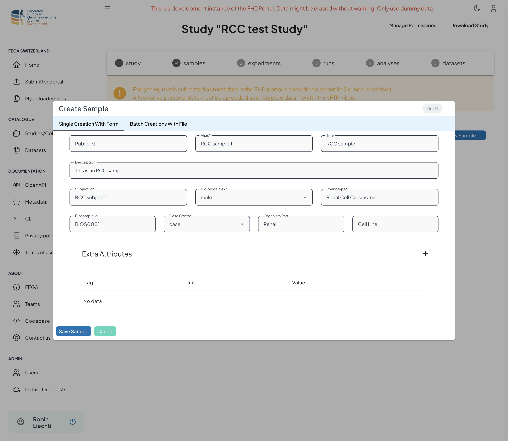

5. Click **Batch Creation with FIle** to create multiple files

6. Download the Excel template

7. Open the template file in Microsoft Excel and fill in with the sample metadata

   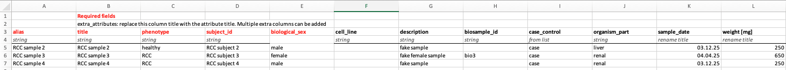

​	You can add extra columns to further describe your samples. In this example, **weight** with **unit=mg** will be recorded as **extra attributes**

8. Upload the Excel file

9. Verify that all samples have been registered successfully.

   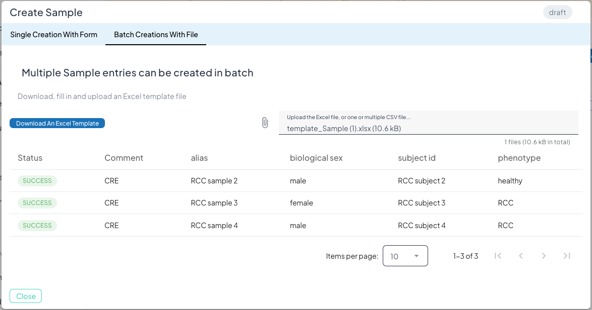

10. Switch to the **Experiments** tab and create one or multiple experiments using the online form or the batch upload, similar to the sample creation.
11. Create a new **Molecular Run**: select a sample and an experiment from the once you have created previously. Associate one or multiple files that were previously uploaded into your SFTP inbox.
    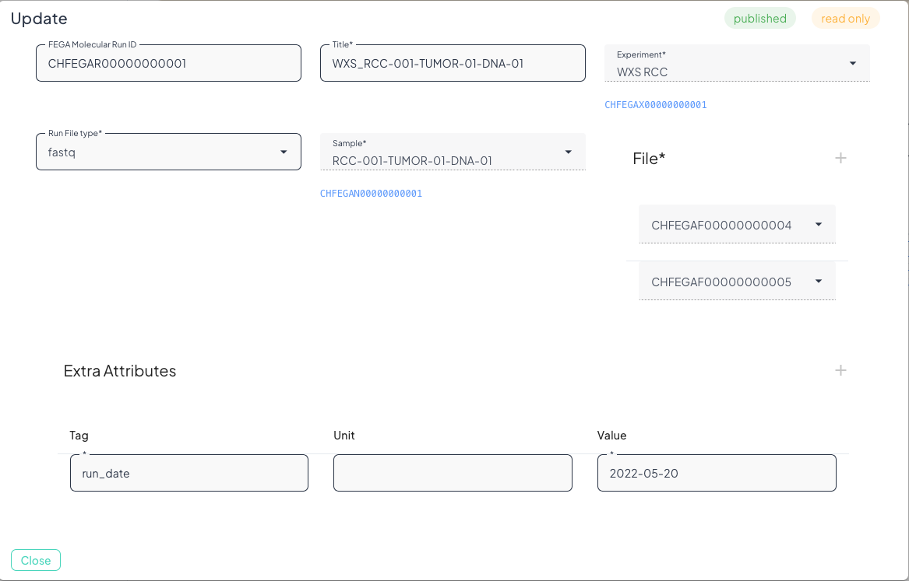
12. Switch to the **analyses** tab and create one or multiple **Molecular Analyses**
13. Switch to the **datasets** tab and create one or multiple **Datasets**. 
14. Associate one or multiple **molecular runs** as well as one of multiple **molecular analyses** to a dataset.
15. Pay attention to the **dataset release date** field. Once the submission is approved, the dataset will be visible in the catalogue section of this portal starting from this date.

### Register a submission with a submission bundle: the FEGA CLI tool

Alternatively to the input forms described above, a complete metadata submission can be done by uploading a submission bundle. The bundle is a ZIP archive containing a JSON manifest file and several TSV files, one for each resource type (study, samples, runs, experiments, analyses, datasets).

1. To prepare a bundle, use the FEGA command line tool (CLI). Navigate to the [**Documentation->CLI**](https://fhd-portal-staging.fega.swiss/cli) section of the portal, and follow the installation instructions.

2. Follow the steps described in the **Quick Start Guide** of the **[Documentation->CLI](https://fhd-portal-staging.fega.swiss/cli)** section of the portal.

3. Some columns of the TSV files are associated to a list of valid terms. To get a full documentation of the TSV format, use the following command:   
   ```bash
   fega document
   ```

4. Once your ZIP bundle is created and validated: navigate to the [Submitter Portal](https://fhd-portal-staging.fega.swiss/submissions)

5. Click on **Submit A New Study...**

6. Click on the **Large Submission In Batch** tab

7. Upload the zip bundle

   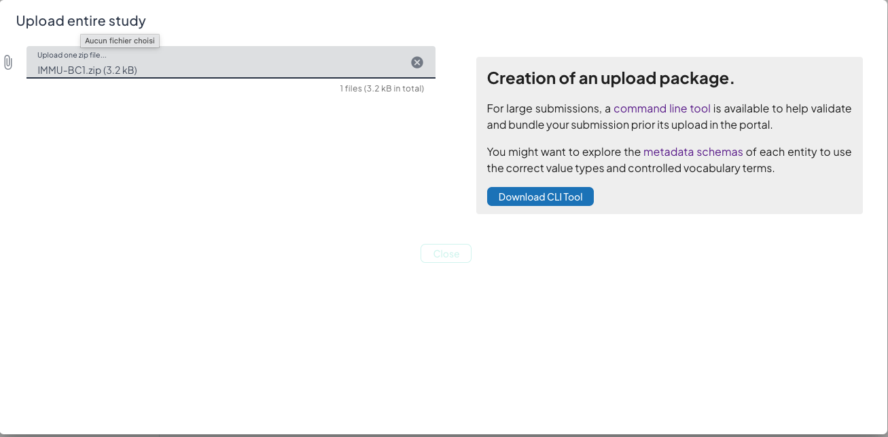

8. If the upload is successful, a green message is displayed and several tabs let you explore the created resources.

9. If the upload failed, a red message is displayed, listing the errors reported in one or several files of the ZIP bundle. Fix the errors, recreate the bundle and upload it again.

   **Caution**: Existing resources in the current study with an identical title will be overwritten.

   

### Associate a policy to every datasets

Every dataset must be associated to a data access policy. The policies are created and managed by a Data Access Committee (DAC) throught the DAC portal of Swiss-FEGA.

1. Click on the **policy...** button and select a policy:

   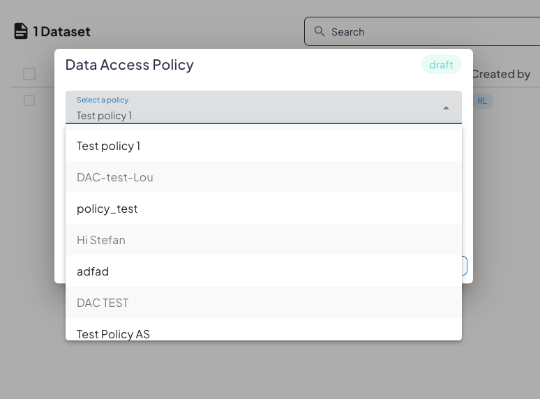

2. Click on **Set Policy** button

3. Once all datasets have an associated policy, the submission can be finalized by clicking on the **Submit study...** button and then the **Confirm Submission** button.

   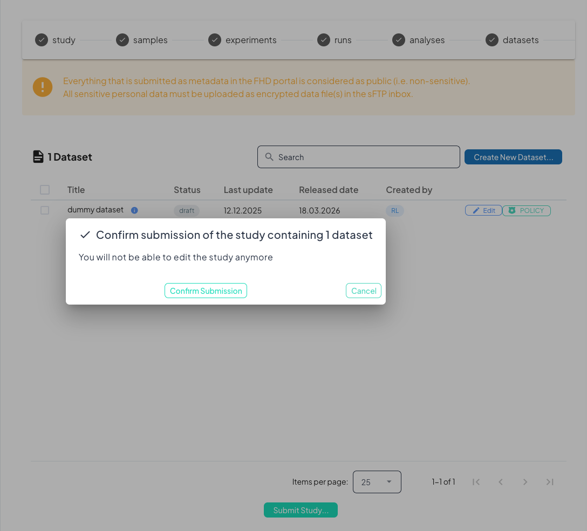

At this stage, DAC members are notified of the new submission and will handle the request in the DAC portal.

## Catalogue and dataset request

The catalogue section of the portal is listing **public** studies and datasets.

1. The **[Studies/Cohorts](https://fhd-portal-staging.fega.swiss/studies)** and **[Datasets](https://fhd-portal-staging.fega.swiss/datasets)** sections are available upon authentication. Clicking one of these links redirects to the login page.

2. The Datasets section lists all available datasets:

   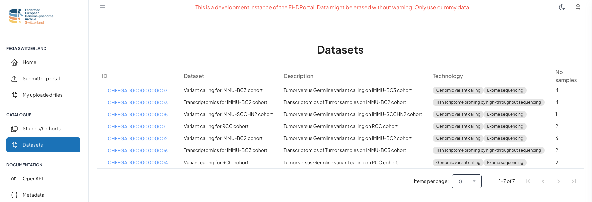

3. Click on one dataset ID to get a detailed view: 

   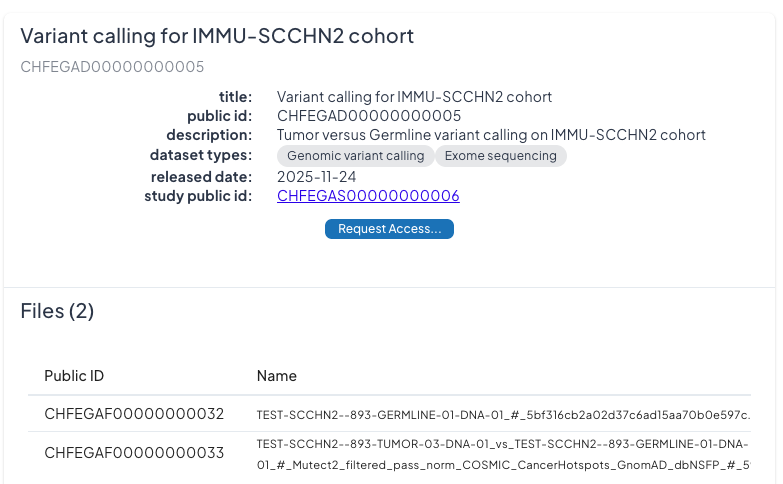

4. Click on **Request Access...** 

5. Generate a [Crypt4GH](https://crypt4gh.readthedocs.io/en/latest/) key pair:

   ```bash
   crypt4gh-keygen --sk alice.sec --pk alice.pub
   ```

6. Upload the *\*.pub* key in the portal:

   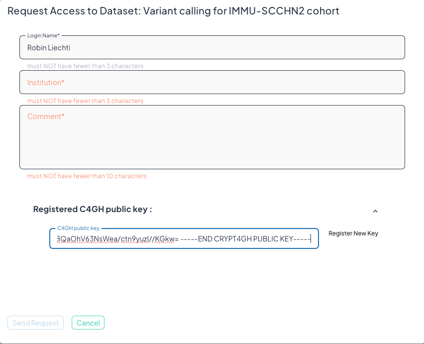

7. Fill in your Institution and a Comment to explain your request
8. Click on **Send Request**
9. You will be contacted by email by the Swiss FEGA Help Desk team.